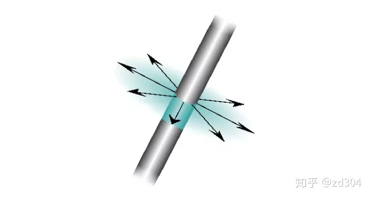
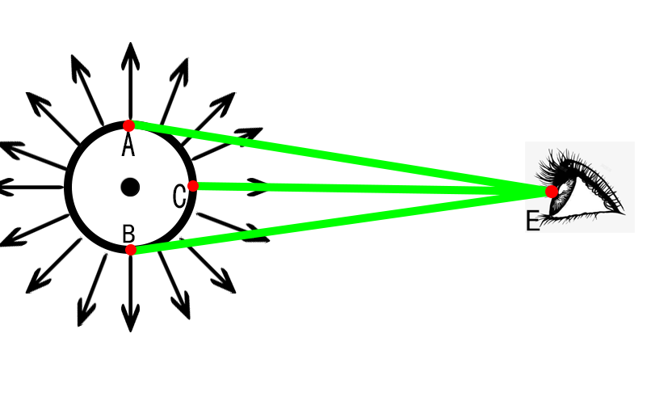

# 一种新的各向异性模型的法线计算及理论推导
* 在现在的图形学渲染过程中，各向异性材质是一种常见的材质，其在拉丝金属，发丝等模型上有着相当广泛的用途。在现在的各向异性材质渲染过程中，通常依赖于sin(T, H)这个经验公式来对光照进行计算，并给出最终颜色。在这里，我们提出一种新的基于物理的各向异性材质计算，并给出数学推导
* 首先，对各向异性材质进行简要分析，各向异性材质往往表现为若干个紧密排列的圆柱，并且这些圆柱的宽度通常是小于一个像素的，那么当我们在渲染这个各向异性材质时，实际上就应该去求得这个亚像素级别的圆柱的表面法线的均值，如果从更严谨的角度来考虑的话，其实还应该求得法线分布函数，并将法线分布函数作为函数g(x)，与其他的法线分布函数合为一个复合函数f(g(x))，作为最终的法线分布函数，并参与到最终的光照计算中
* 每一个微小的圆柱的形状，以及法线分布的形状已经被传烂了，但还是在这里发一下

* 当我们从一个方向看向这个物体时，实际上看到的是这个圆柱的一小部分，类似于下图

* 然后其实我们可以简单地积分得到，摄像机视角下，当看到一个完整的柱面时，所得到的一个平均法线"看起来"就是我们的ToEye的方向，也就是向量CE的方向，但显然，视角的方向很少会刚好处在圆柱的法平面上，所以这里的公式还需要进一步的处理，不过其实空间立体想象力好一些的同志已经想到了，我们积分得到的平均应该就是ToEye在圆柱的法平面上的投影，公式是normalize(ToEye - dot(ToEye, Tangent) * Tangent)，不过在这其中存在一个问题，即当视线方向刚好与切线方向平行时，会由于normalize隐含的除法，导致一个除零错误
* 但经过我们TA在测试通过使用新的方式生成的各向异性法线来进行渲染时，即使在特意卡角度的情况下，也难以发现(准确说是没有发现)由于除零错误所引发的效果异常，同时在于通过传统的Kajiya模型所渲染出的头发相比，通过新方法所生成的各向异性材质与周围其他的材质的融洽度更强，而基于Kajiya模型所渲染出的头发会更容易出现高光过爆的问题，另外还有单看Kajiya头发的时候效果不错，但是如果放在环境中相对有些奇怪的问题。
* 另外一个扩展是这样，我们或许可以为每个点再额外指定一个法线，以及一个展露角，这样的话积分时在角度上就需要考虑展露角对积分范围的影响，或许效果上会更真实一些，但是可能也说不准

------
* 总结
    1. 我们可以通过normalize(ToEye - dot(ToEye, Tangent) * Tangent)公式所的结果，作为法线传入任意光照模型中进行计算，而不再使用sin(T, H)的经验公式来进行高光计算
    2. 对于非高光部分，我们同样可以使用normalize(ToEye - dot(ToEye, Tangent) * Tangent)进行漫反射光照的计算，来呈现出更真实的效果
    3. 在公式中，在数学上存在一个当ToEye与Tangent平行时会发生的隐晦的除零错误，但在TA的测试用，并未发现这一现象。原因可能是由下列两条共同促成，但如果在项目章使用时，还是推荐加上一个小的偏移，来避免出现隐式的除零错误
        1. 由于浮点数误差，导致ToEye很难真的与Tangent完全一致
        2. 由于当ToEye与Tangent平行时，往往三角形在屏幕上也会退化，或者接近退化为一条线，使得看到问题
    4. 在这种新的各向异性法线下，根据TA的反馈，我们所求得的光照与环境的融洽程度更高，效果上更为真实，同时也更加贴近物理世界，避免了由于经验公式所造成的潜在的拟合问题