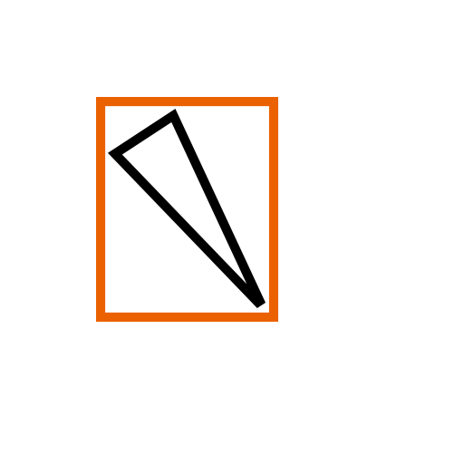
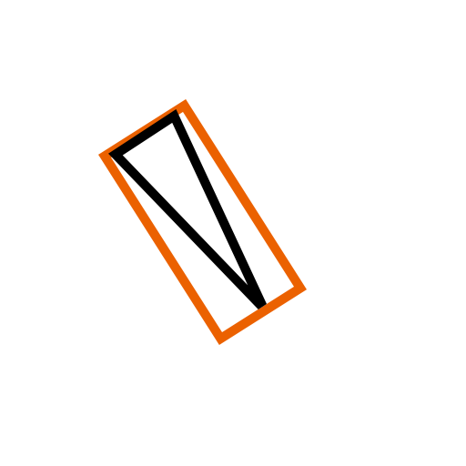

* 在阴影渲染过程中，平行光是非常常见的用于产生阴影的光源，甚至在相当一部分游戏中，只会制定一个用于产生阴影的平行光作为主光源。所以对平行光阴影贴图的优化往往可以获得较大的收益。
* 最终推得的View矩阵是这样
    * 首先我们获取到摄像机的Forward，Up，Right方向，以及光源方向LightDir
    * 而后将Forward，Up，Right分别于LightDir做Dot，并从中选出Dot后的结果最小的一个摄像机轴向量，并命名这条向量为CameraDir
    * 而后，我们使用normalize(CameraDir - dot(LightDir, CameraDir) * LightDir))作为View矩阵的X轴，将其定义为ViewX
    * View矩阵的Z轴是显然的，必定为LightDir
    * View矩阵的Y轴可以通过简单地叉乘来得到，即Cross（ViewX， LightDir）
    * 通过这种方式，我们可以让平行光投影时的视锥体（其实不能算是椎体，算是一个柱体了）发生一个旋转，并且使得旋转后的视锥体与地面的交叉矩形的方向倾向于摄像机的朝向，使得阴影贴图的利用率得到提高
    * 优化前的阴影贴图与视锥体的交叉形状类似于这样，其中橙黄色部分代表平行光视锥体，而黑色部分代表摄像机
    
    * 优化后的阴影贴图与视锥体的交叉形状类似于这样，其中橙黄色部分代表平行光视锥体，而黑色部分代表摄像机
    
    * 在这个过程中可以看出，在尽可能让平行光投影视锥体范围紧密的包围住视锥体的前提下，使用优化后的View矩阵可以让阴影贴图的利用率得到一个非常明显的提高

* 总结
    * 我们可以通过比较摄像机Forward，Up，Right三个轴与光源方向的Dot结果，来获得三个轴中，最接近于光源方向法平面的向量CameraDir
    * 而后我们通过公式normalize(CameraDir - dot(LightDir, CameraDir) * LightDir))获得到了Camera在LightDir的法平面上的投影，并将其设定为View矩阵的X轴
    * 我们将LightDir(View矩阵的Z轴)与View矩阵的X轴做Cross，得到View矩阵的Z轴
    * 我们可以再求出视锥体在变换后的空间的AABB盒，并根据其中心点来得到View矩阵的Position偏移
    * 但是在这个过程中存在一个问题
        * 我们在计算的初始步骤有这样一个计算是获取到Forward，Up，Right中最接近光源方向法平面的向量，这样的话当摄像机与光源的夹角在某些特定角度下，就很容易出现选取的向量的反复跳变，可能会导致阴影贴图发生闪烁，但也可能不会有太过于明显的变化，这个需要后续的进一步验证